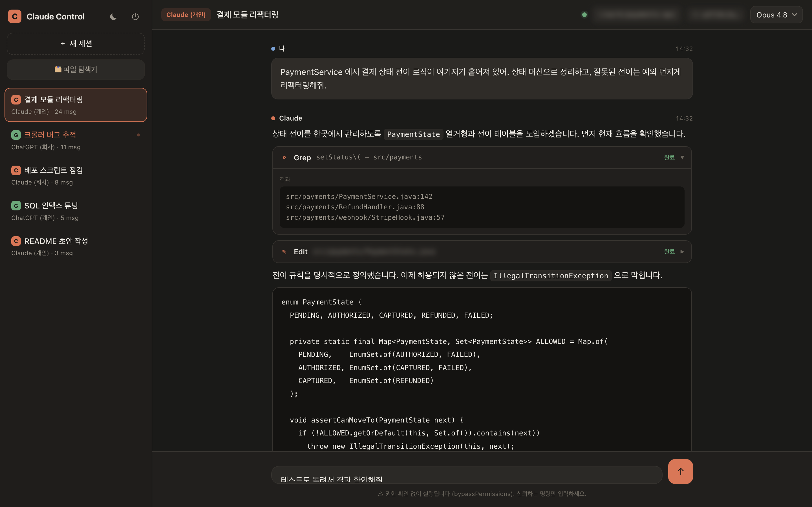
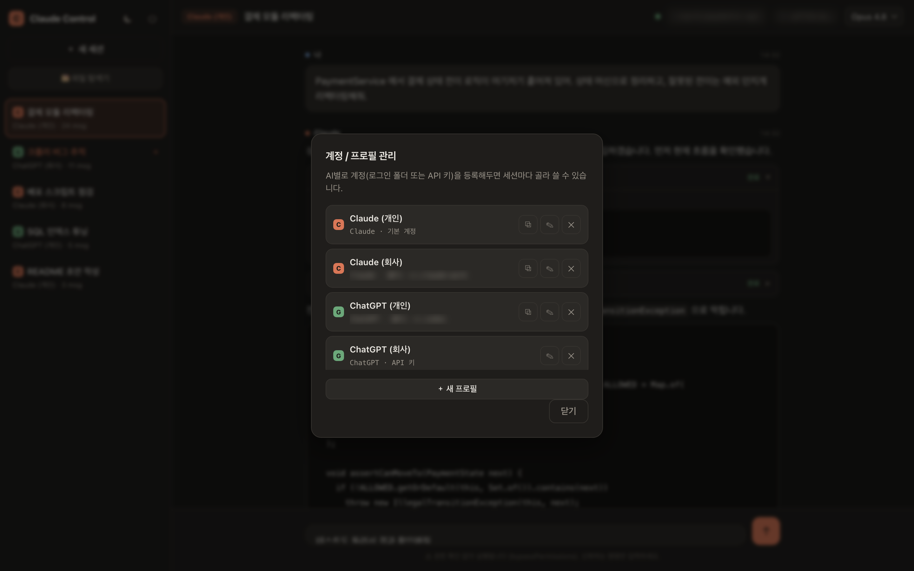
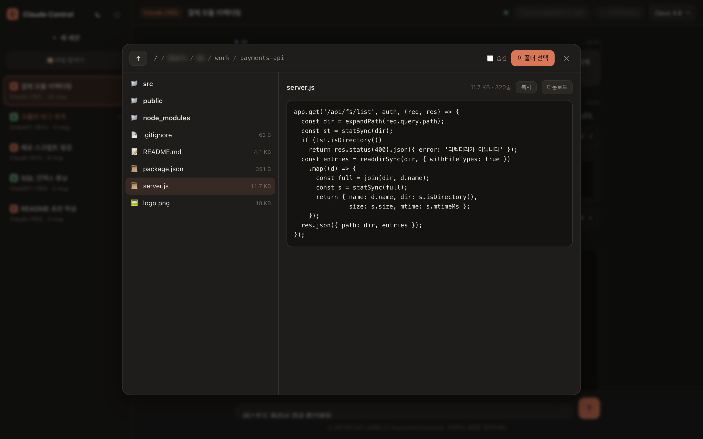

# Claude Control

브라우저에서 원격지의 맥에 설치된 **Claude Code 및 ChatGPT(Codex)** 를 조작하는 웹 기반 원격 제어 패널입니다. 윈도우 노트북, 태블릿, 스마트폰 등 어떤 기기에서든 접속하여 세션을 생성하고 명령을 전달하면, 실제 실행은 맥에서 이루어집니다.

## 개요

개발 환경과 계정 로그인 정보가 특정 맥에 집중되어 있는 상황에서, 다른 기기로 이동하거나 외부에서 작업을 확인해야 할 때마다 해당 장비 앞으로 돌아가야 하는 불편을 해소하기 위해 개발했습니다. 접속은 Tailscale 테일넷 내부로 제한되며, 비밀번호 인증을 추가로 요구합니다.

초기에는 Claude Code 단일 엔진만 지원했으나, 이후 ChatGPT(Codex)를 함께 사용할 수 있도록 확장했고, 동일 AI에 대해 개인·업무 계정을 분리해 운용할 필요가 생기면서 프로필(계정) 관리 체계를 도입했습니다.

## 화면

**메인 화면** — 좌측에 세션 목록(엔진 및 계정 배지 포함)이 표시되고, 중앙에서 대화가 실시간으로 스트리밍됩니다. 도구 실행 내역과 코드 블록도 함께 렌더링됩니다.



**계정 · 프로필 관리** — AI별로 여러 계정을 등록해 두고 세션마다 선택하여 사용합니다. 계정 구분은 로그인 설정 폴더 분리 또는 API 키 지정 방식으로 처리합니다.



**파일 탐색기** — 맥의 파일 시스템을 브라우저에서 직접 탐색합니다. 코드 및 이미지 미리보기, 파일 다운로드, 작업 폴더 선택을 지원합니다.



## 주요 기능

- **다중 AI · 다중 계정 지원** — 세션 단위로 Claude 또는 ChatGPT를 선택할 수 있으며, 동일 AI라도 개인·업무 등 계정을 별도로 등록해 사용할 수 있습니다. 서버는 실행 시점에 해당 계정의 환경(설정 폴더 또는 API 키)을 주입하여 계정 간 격리를 보장합니다.
- **다중 세션** — 여러 세션을 동시에 유지하며 각 세션의 대화 맥락이 보존됩니다(`--resume`). 한 세션이 실행되는 동안 다른 세션을 확인할 수 있습니다.
- **실시간 스트리밍** — 응답, 사고 과정, 도구 호출 및 결과가 생성되는 즉시 브라우저로 전달됩니다. 실행 중에는 중단이 가능합니다.
- **파일 탐색기** — 폴더 이동, 파일 열람(텍스트·이미지), 다운로드를 제공하며, 새 세션 생성 시 작업 폴더 선택에 활용됩니다.
- **반응형 UI** — 다크·라이트 테마, 모바일 레이아웃, 안전 영역(노치) 대응을 지원하여 모바일 환경에서도 조작할 수 있습니다.

## 구조

외부 의존성은 `express`와 `ws` 두 가지로 제한하여 경량 구성을 유지합니다.

- **`server.js`** — Express와 WebSocket 서버. 메시지 수신 시 세션에 지정된 프로필에 따라 `claude` 또는 `codex` 프로세스를 실행하고, 두 CLI의 출력을 단일 이벤트 형식으로 정규화하여 브라우저로 중계합니다. 이를 통해 프런트엔드는 실행 중인 엔진의 종류와 무관하게 동작합니다.
- **`public/`** — 로그인 및 멀티세션 채팅 UI. 프레임워크 없이 순수 JavaScript로 구현되었으며, 마크다운 렌더러 또한 자체 구현되어 있습니다.
- **`data/`** — 비밀번호 해시, API 토큰, 세션 기록, 프로필 정보를 저장합니다. 민감 정보를 포함하므로 버전 관리에서 제외됩니다(`.gitignore`).

## 설치 및 실행

```bash
git clone https://github.com/IMCODER0000/claude-control.git
cd claude-control
npm install
node server.js
```

최초 실행 시 아이디와 비밀번호가 콘솔에 출력됩니다. 변경은 다음 명령으로 수행합니다.

```bash
node server.js --set-password
```

실행 환경의 맥에는 `claude` CLI가 설치되어 있어야 합니다. ChatGPT 엔진을 사용하려면 `npm i -g @openai/codex`로 Codex CLI를 설치한 뒤 계정 로그인이 필요합니다. 계정별 로그인 명령은 프로필 관리 화면에서 복사하여 터미널에서 실행할 수 있습니다.

## 접속 방법

서버는 기본적으로 맥의 Tailscale IP에 바인딩됩니다. 동일 테일넷에 연결된 기기에서 다음 주소로 접속합니다.

```
http://<맥의 테일넷 IP>:8787
```

테일넷 IP는 `tailscale ip -4` 명령으로 확인할 수 있습니다. 사내망 등에서 차단되는 경우에도 Tailscale이 릴레이를 통해 연결을 유지하는 것이 일반적입니다. 연결이 불가능한 환경에서는 `cloudflared tunnel`로 임시 공개 주소를 생성할 수 있으나, 이 경우 비밀번호가 유일한 보호 수단이 되므로 주의가 필요합니다.

## 자동 실행

맥 로그인 시 자동으로 시작되고 프로세스 종료 시 자동으로 재시작되도록 launchd에 등록되어 있습니다.

```bash
launchctl list | grep claude-control                                    # 상태 확인
launchctl unload ~/Library/LaunchAgents/com.choi.claude-control.plist    # 중지
launchctl load   ~/Library/LaunchAgents/com.choi.claude-control.plist    # 시작
```

## 보안 유의사항

본 도구는 권한 확인 절차 없이(`bypassPermissions`) 명령을 실행합니다. 즉, 브라우저에서 입력한 명령이 맥에서 즉시 실행됩니다. 편의를 위한 설계이나, 그만큼 **비밀번호와 테일넷 접근 제한이 사실상 유일한 방어선**이므로 신뢰할 수 없는 환경에서의 접속은 피해야 합니다. 저장소는 공개되어 있으나 실제 로그인 정보와 세션 기록은 `data/` 디렉터리에 보관되며 버전 관리에 포함되지 않습니다.

## 향후 과제

- ChatGPT(Codex) 출력 파서는 실제 버전의 출력을 기준으로 추가 보완이 필요합니다. 버전마다 JSON 스키마에 차이가 있어 현재는 관대한 파싱 방식을 적용하고 있습니다.
- 세션 검색 및 대화 내보내기 기능을 추가할 예정입니다.
